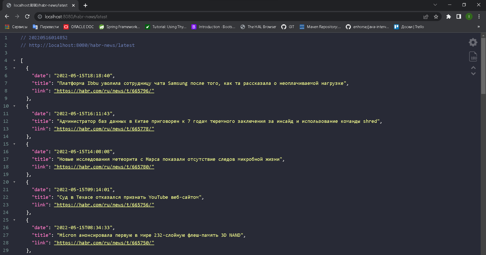
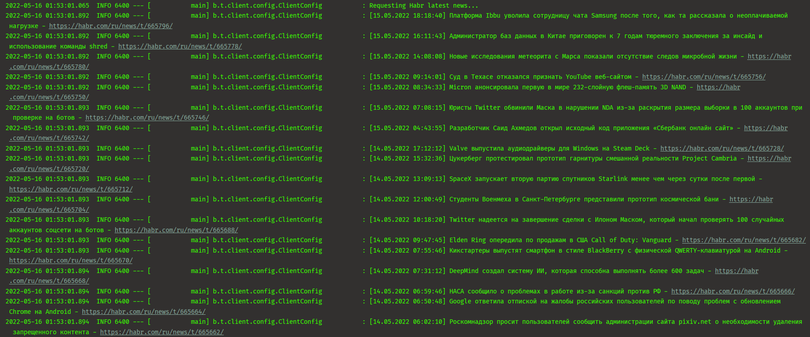

# TeachMeSkills HOMEWORK REST service + client

## Spring Boot, Spring MVC, jsoup, Maven training.

--- 

## Table of contents

### 1. [Task](#task)

### 2. [How it works?](#how-it-works)

--- 

### Task

> Create a `REST API` for parsing data from any site you choose and 
> a corresponding console application that will take data 
> from the service in `JSON` format and display it on the command line.

---

### How it works?

#### REST API response

#### Client application output

